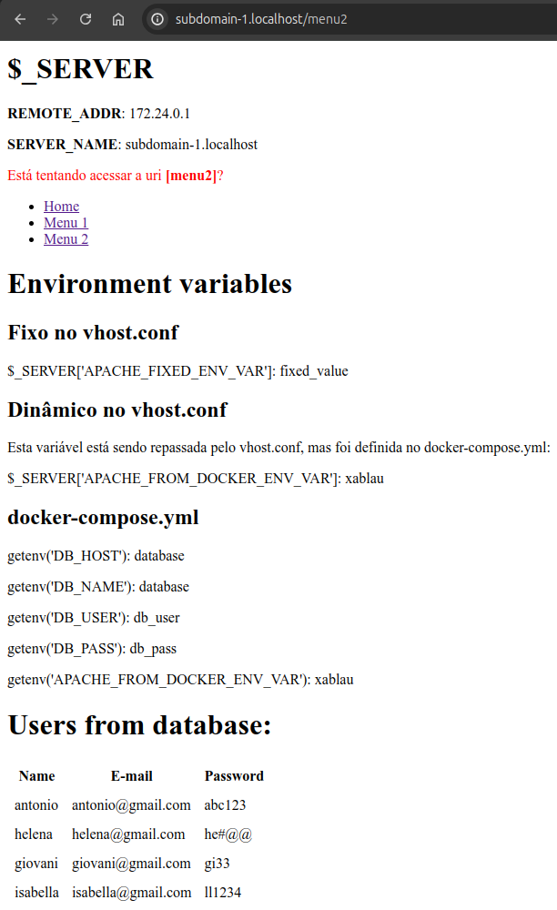

# Docker + Apache2 + PHP7.4 + VHOST

Este projeto visa preparar um ambiente para desenvolvimento local com PHP7.4 e Apache2 e sua configuração de VHost com Docker.

Porque `container_name` tem valor `dev.local`, então no `/etc/hosts` configure:

```
127.0.0.1 dev.local
```

